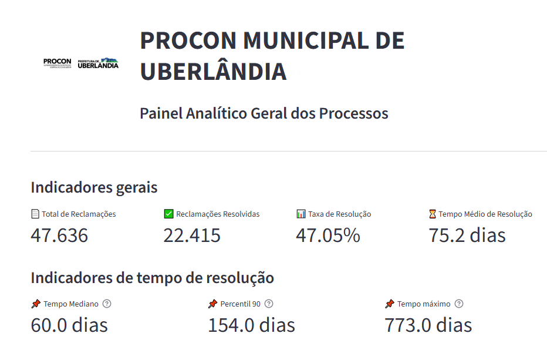
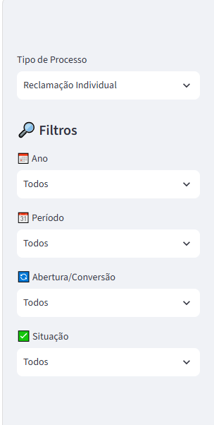
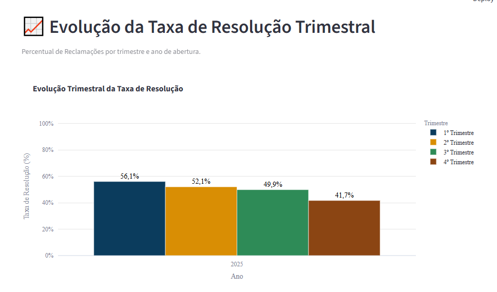
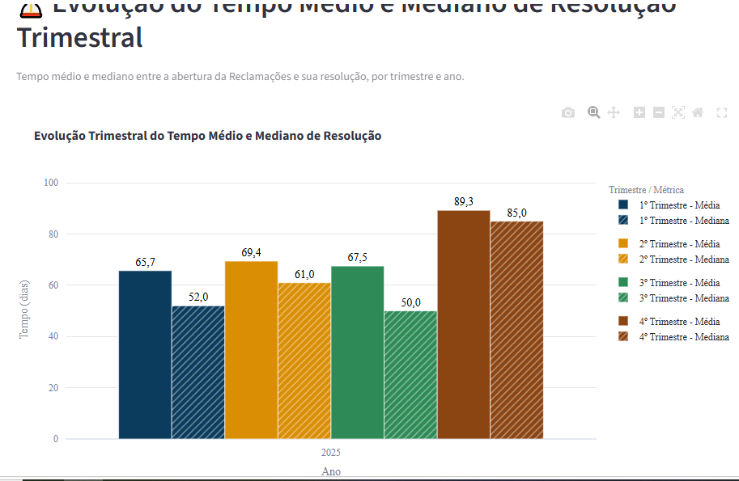

# Painel Analítico — Procon Municipal de Uberlândia

Dashboard analítico da eficiência geral do Procon de
Uberlândia, com indicadores sobre reclamações individuais, negociações de
dívida e processos administrativos.

## Visão geral

O projeto acessa diretamente o banco de dados do sistema **Fale Procon** e
monta, em memória, uma ABT (*Analytical Base Table*) com as variáveis de
negócio necessárias para os gráficos e indicadores do painel. Toda vez que o dashboard
é aberto, os dados são consultados e transformados na hora, refletindo o
estado atual do banco.

## Definição importante: como interpretar "resolvidas", "taxa de resolução" e "tempo médio"

**Todos os indicadores de resolução (quantidade de resolvidas, taxa de
resolução e tempo médio/mediano de resolução) são calculados sobre a coorte
de processos *abertos* no período selecionado — não sobre os processos
*resolvidos* naquele período.**

Ou seja, ao filtrar, por exemplo, o Ano = 2025:

- **O que o painel mostra:** dos processos que foram **abertos em 2025**, quantos
  **já estão resolvidos hoje** (na data em que o painel foi consultado).
- **O que o painel NÃO mostra:** quantos processos foram resolvidos durante o
  ano de 2025, independentemente de quando foram abertos.

O objetivo é medir a efetividade do atendimento
por safra de abertura ("de tudo que entrou em tal período, quanto já foi
resolvido"), e não o volume de resoluções ocorridas numa janela de tempo.
Um processo aberto em dezembro/2025 e resolvido em janeiro/2026, por
exemplo, entra na coorte "aberto em 2025" e conta como resolvido nela — o
tempo de resolução é medido entre a data de abertura e a data da última
interação relevante de resolução, independente do ano em que a resolução
ocorreu.

Isso vale para todas as visões (anual, semestral e trimestral) e para os
filtros de Ano/Período.

## Arquitetura

```
Banco de dados (Fale Procon)
        │
        ▼
 services/queries_2.py        → consultas SQL brutas (1 processo = 1 linha
                                  na abertura; 1 linha por processo no
                                  status de resolução, já deduplicado via
                                  ROW_NUMBER no próprio SQL)
        │
        ▼
 services/transformacoes_2.py → funções puras de transformação (sem acesso
                                  a banco): classificação de origem,
                                  cálculo de processo_resolvido, variáveis
                                  de tempo (ano/mês/semestre/trimestre de
                                  abertura, dias até resolução, faixas de
                                  tempo)
        │
        ▼
 services/abt_2.py            → orquestra queries + transformações e monta
                                  a ABT final (carregar_abt)
        │
        ▼
 app.py                        → dashboard Streamlit: filtros, KPIs e
                                  gráficos (Plotly), consumindo a ABT
```

Cada tipo de processo (Reclamação Individual, Negociação de Dívida,
Processo Administrativo) tem sua própria configuração de interações de
abertura e mapa de origem, centralizados em `dic_interacoes_2.py`
(`CONFIG_PROCESSOS` e `CONFIG_TEXTOS`), permitindo reaproveitar toda a
lógica de cálculo do dashboard para os três tipos sem duplicar código.

## Estrutura de arquivos

```
procon_analytics/
├── app.py                      # Dashboard Streamlit
├── config.py                   # Configuração de conexão
├── requirements.txt            # Dependências Python
├── services/
│   ├── database.py             # Criação da engine SQLAlchemy
│   ├── queries.py            # Consultas SQL brutas ao banco
│   ├── transformacoes.py     # Regras de negócio / variáveis derivadas
│   ├── abt_2.py                # Monta a ABT final
│   └── dic_interacoes.py     # Dicionário de tipos de interação e
│                                # configuração por tipo de processo
├── dashboard/
│   └── assets/                 # Logo e demais recursos visuais
```

> **Nota de organização:** alguns módulos ainda carregam o sufixo `_2`
> (herdado do processo de iteração do projeto). Antes da entrega final,
> recomenda-se renomear para os nomes definitivos (`queries.py`,
> `transformacoes.py`, `abt.py`, `dic_interacoes.py`) e remover as versões
> antigas, para não gerar confusão em quem for dar manutenção.

## Principais indicadores do painel

- **Evolução do número de processos** (anual, semestral ou trimestral,
  conforme o filtro de Período selecionado)
- **Taxa de resolução** — percentual de processos resolvidos, sempre por
  coorte de abertura (ver seção acima)
- **Tempo de resolução** — média, mediana, percentil 90 e tempo máximo,
  além da distribuição por faixas de tempo
- **Distribuição mensal** dos processos (heatmap ano × mês)
- **Top 10 motivos/categorias de movimentação final** — quais tipos de interação
  final mais aparecem no fechamento dos processos.

## Filtros disponíveis

- **Tipo de Processo**: Reclamação Individual, Negociação de Dívida ou
  Processo Administrativo
- **Ano** de abertura
- **Período**: Todos, 1º–4º Trimestre ou 1º–2º Semestre — filtro único que
  também define a granularidade dos gráficos de evolução (visão trimestral
  quando um trimestre específico é escolhido, semestral quando um semestre
  específico é escolhido, e um padrão automático quando "Todos": semestral
  comparando anos, ou trimestral dentro de um único ano)
- **Abertura/Conversão**: origem do processo (nasceu no tipo selecionado ou
  foi convertido para ele)
- **Situação**: Todos, Resolvida ou Não Resolvida

## Visualização





